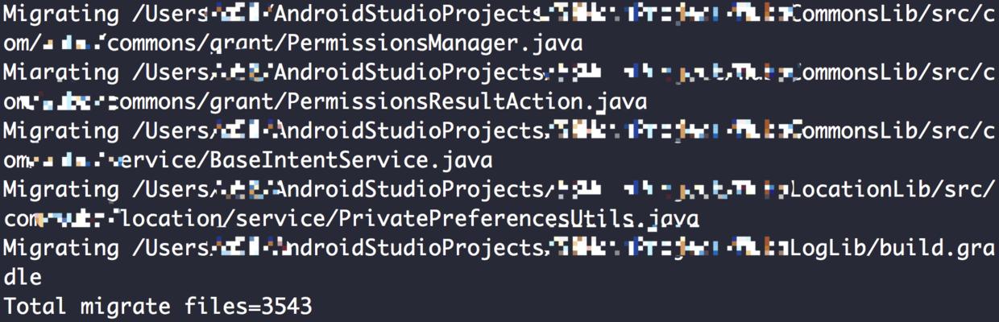

# MigrateToAndroidX

用于帮助迁移到AndroidX。

## 前言
通过Android Studio提供的Migrate to AndroidX功能并不能很好地处理所有文件，所以才有了此脚本。原理：通过Android官方网站提供的类映射关系，扫描工程中所有文件进行替换。

## 使用

打开终端在工程根目录执行以下命令：
```
git clone git@github.com:yuweiguocn/MigrateToAndroidX.git
python MigrateToAndroidX/migrate.py
```


